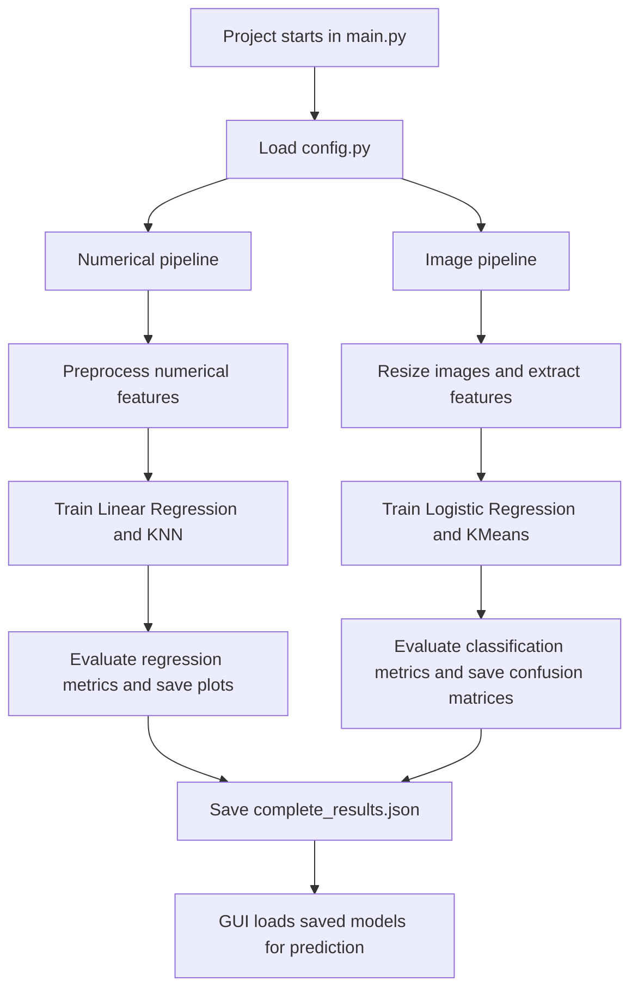
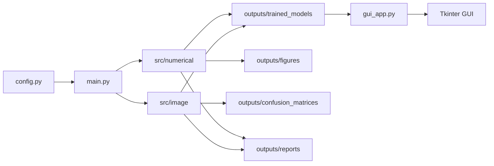
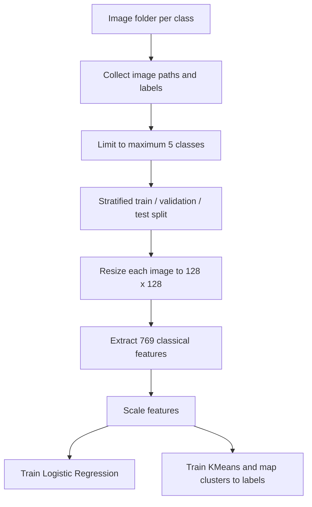
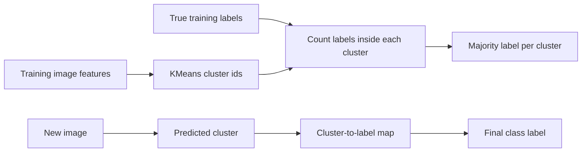
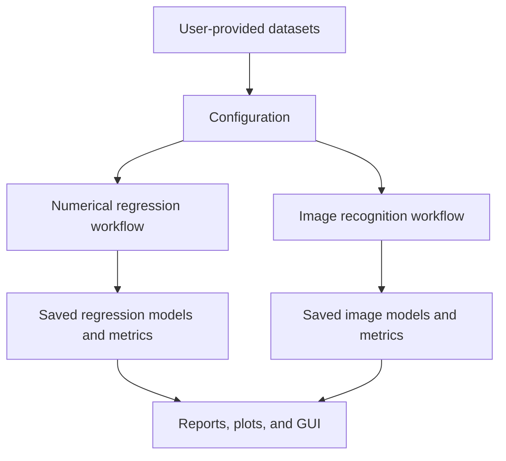
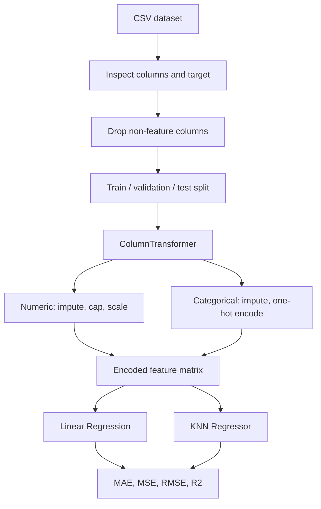
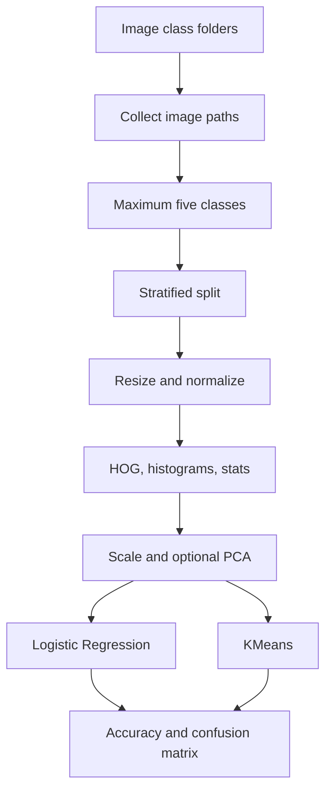

# Machine Learning Project Discussion Preparation Guide

**Subtitle:** Detailed Project Pathway and Viva Preparation Guide  
**Project:** Numerical Regression and Image Classification with Classical Machine Learning  
**Prepared for:** University project discussion / viva / presentation  
**Student / Team:** ______________________________  
**Course:** ______________________________  
**Instructor:** ______________________________  
**Date:** 2026-05-09

---

## 1. Cover Page

This guide explains the complete machine learning project pathway, from dataset loading to model evaluation and GUI-based prediction. It is written to help the student defend the project confidently in front of an instructor who may ask about code, concepts, metrics, model choices, diagrams, and limitations.

The project contains two main machine learning tasks:

- A numerical regression task using Linear Regression and KNN Regressor.
- An image classification task using Logistic Regression and KMeans.

The project uses only the datasets placed inside the local project folders:

- `datasets/numerical/`
- `datasets/images/`

No external dataset is downloaded, generated, or substituted.

---

## 2. Executive Overview

The project is a complete classical machine learning application. It compares supervised regression models on a numerical dataset and compares supervised classification with unsupervised clustering on an image dataset.

For the numerical part, the target variable is `salary_in_usd` from the dataset `Cyber Security Salaries Dataset`. The goal is to predict a continuous numeric value, so the correct evaluation metrics are MAE, MSE, RMSE, and R2.

For the image part, the dataset is `Flowers Recognition Image Dataset`. The final selected classes are: daisy, dandelion, rose, sunflower, tulip. The goal is to classify an input image into one of these class labels. Since this is classification, the correct evaluation metrics are accuracy, confusion matrix, precision, recall, and F1-score.

The four required models are all present:

- Linear Regression: supervised model for numerical prediction.
- KNN Regressor: supervised distance-based model for numerical prediction.
- Logistic Regression: supervised classifier trained on extracted image features.
- KMeans: unsupervised clustering model adapted for classification through cluster-to-label majority voting.

The project also contains a Tkinter GUI so a user can manually enter numerical feature values, upload an image, choose a model, and view predictions and saved evaluation results.

---

## 3. Project Pathway / End-to-End Pipeline

The project follows a full machine learning workflow:

1. Dataset paths and important settings are defined in `config.py`.
2. `main.py` creates the output folders and runs both pipelines.
3. The numerical dataset is loaded from `datasets/numerical/salaries_cyber.csv`.
4. The numerical pipeline inspects columns, detects feature types, handles missing values, splits the data, applies preprocessing, trains two models, evaluates them, saves models, and saves plots.
5. The image dataset is loaded from subfolders inside `datasets/images/`.
6. The image pipeline restricts the class count to a maximum of five classes, loads image paths, applies stratified splitting, resizes images, extracts classical features, trains two models, evaluates them, saves models, and saves confusion matrices.
7. `outputs/reports/complete_results.json` stores the combined numerical and image results.
8. Documentation and reports are saved in `docs/` and `outputs/reports/`.
9. `gui_app.py` starts a Tkinter GUI that loads the trained models from `outputs/trained_models/` and uses the same preprocessing/feature extraction logic for prediction.

The important academic point is that training, validation, and testing are separated. Preprocessing objects are fitted only on training data during model selection, then final models are trained using train plus validation data and tested on the held-out test set. This helps reduce data leakage.



---

## 4. Repository / Codebase Walkthrough

The project is organized so that each responsibility has its own module.

Important root files:

- `main.py`
- `config.py`
- `gui_app.py`
- `requirements.txt`

Numerical source files:

- `src/numerical/__init__.py`
- `src/numerical/data_preprocessing.py`
- `src/numerical/evaluate_regression.py`
- `src/numerical/feature_engineering.py`
- `src/numerical/train_knn_regressor.py`
- `src/numerical/train_linear_regression.py`
- `src/numerical/utils.py`

Image source files:

- `src/image/__init__.py`
- `src/image/evaluate_classification.py`
- `src/image/feature_extraction.py`
- `src/image/image_preprocessing.py`
- `src/image/train_kmeans.py`
- `src/image/train_logistic_regression.py`
- `src/image/utils.py`

GUI files:

- `gui/__init__.py`
- `gui/image_tab.py`
- `gui/main_window.py`
- `gui/numerical_tab.py`
- `gui/results_tab.py`
- `gui/styles.py`
- `gui/utils.py`

Selected output files:

- `outputs/confusion_matrices/kmeans_confusion_matrix.png`
- `outputs/confusion_matrices/logistic_regression_confusion_matrix.png`
- `outputs/figures/image_model_comparison.png`
- `outputs/figures/knn_regressor_predicted_vs_actual.png`
- `outputs/figures/knn_regressor_residuals.png`
- `outputs/figures/linear_regression_predicted_vs_actual.png`
- `outputs/figures/linear_regression_residuals.png`
- `outputs/figures/numerical_target_distribution.png`
- `outputs/figures/regression_model_comparison.png`
- `outputs/reports/complete_results.json`
- `outputs/reports/image_classification_report.txt`
- `outputs/reports/image_classification_results.json`
- `outputs/reports/numerical_regression_report.txt`
- `outputs/reports/numerical_regression_results.json`
- `outputs/trained_models/kmeans_cluster_mapping.joblib`
- `outputs/trained_models/kmeans_image_classifier.joblib`
- `outputs/trained_models/kmeans_image_scaler.joblib`
- `outputs/trained_models/knn_regressor_model.joblib`
- `outputs/trained_models/knn_regressor_preprocessor.joblib`
- `outputs/trained_models/linear_regression_model.joblib`
- `outputs/trained_models/linear_regression_preprocessor.joblib`
- `outputs/trained_models/logistic_regression_image_classifier.joblib`
- `outputs/trained_models/logistic_regression_image_pca.joblib`
- `outputs/trained_models/logistic_regression_image_scaler.joblib`

The architecture is intentionally modular. `config.py` centralizes paths, target column names, image size, split ratios, and hyperparameter grids. `main.py` is the orchestration script. It does not contain the model details itself; instead, it calls `run_numerical_pipeline` and `run_image_pipeline`.

The numerical preprocessing logic is in `src/numerical/data_preprocessing.py`. It identifies numerical and categorical columns, builds a `ColumnTransformer`, handles missing values, one-hot encodes categorical variables, scales numerical variables, checks target skewness, and handles outliers conservatively.

The numerical model scripts are `train_linear_regression.py` and `train_knn_regressor.py`. They train models, compare validation performance, evaluate on the test set, and save joblib artifacts.

The image preprocessing logic is in `src/image/image_preprocessing.py`. It finds class folders, limits the number of classes to five, collects image paths, splits the dataset, and loads/resizes images consistently.

The image feature extraction logic is in `src/image/feature_extraction.py`. It converts each image into a fixed-length numerical feature vector using color histograms, grayscale histogram, color statistics, local grid statistics, gradient features, edge density, and HOG-style texture/shape features.

The GUI uses `gui/main_window.py`, `gui/numerical_tab.py`, and `gui/image_tab.py`. The GUI does not retrain the models. It loads saved models and preprocessing objects from `outputs/trained_models/`, which is the correct behavior for a prediction application.



---

## 5. Numerical Dataset Section

The numerical dataset used in the current run is `Cyber Security Salaries Dataset`. The file is loaded from `datasets/numerical/salaries_cyber.csv`.

Dataset details from the saved results:

- Original shape: [1247, 11]
- Used shape after dropping configured non-feature columns: [1247, 9]
- Total samples: 1,247
- Training samples: 872
- Validation samples: 187
- Test samples: 188
- Target variable: `salary_in_usd`
- Raw input features: work_year, experience_level, employment_type, job_title, employee_residence, remote_ratio, company_location, company_size
- Numerical features: work_year, remote_ratio
- Categorical features: experience_level, employment_type, job_title, employee_residence, company_location, company_size
- Final encoded feature count saved in metadata: 206

The target distribution is important because salary-like data often contains extreme values. In this run, the target skewness was 2.4795. The code checked whether `log1p` transformation should be used. It was considered because the target was skewed, but the final saved results show `selected_log1p_transform = False` for Linear Regression and `False` for KNN. The pipeline chose the transformation only if validation RMSE improved.

The numerical preprocessing pipeline uses:

- Median imputation for missing numerical values.
- Most-frequent imputation for missing categorical values.
- Conservative IQR clipping for numerical feature outliers.
- StandardScaler for numerical features.
- OneHotEncoder for categorical features.
- ColumnTransformer to combine both branches safely.

This design is academically clean because every preprocessing step is part of a fitted pipeline rather than being done manually on the full dataset.


[[IMAGE:outputs/figures/numerical_target_distribution.png|Target distribution used to inspect skewness and outliers.]]


Regression means predicting a continuous numeric value. It is different from classification, where the output is a class label. That is why this project does not use accuracy or confusion matrix for regression. Regression is evaluated using errors and goodness-of-fit metrics.

---

## 6. Linear Regression Section

Linear Regression is a supervised regression model that assumes the target can be approximated as a weighted sum of input features:

```text
y = b0 + b1*x1 + b2*x2 + ... + bn*xn
```

The model learns the coefficients that minimize prediction error. In this project, Linear Regression is suitable as a baseline because it is simple, interpretable, and easy to explain. It tells us how well a mostly linear relationship can model the target after preprocessing.

Implementation details:

- File: `src/numerical/train_linear_regression.py`
- Model: `sklearn.linear_model.LinearRegression`
- Preprocessing: saved separately as `linear_regression_preprocessor.joblib`
- Model bundle: `linear_regression_model.joblib`
- Optimizer concept: ordinary least squares solver inside scikit-learn.
- Learning rate: not applicable, because scikit-learn Linear Regression solves the least-squares problem directly.
- Regularization: none, because the required model is plain Linear Regression.
- Target transformation: tested using validation performance and only used if helpful.

Hyperparameters/settings from the saved run:

- `fit_intercept`: True
- `positive`: False
- `selected_log1p_transform`: False

Strengths:

- Easy to explain.
- Fast to train.
- Useful baseline model.
- Coefficients can be interpreted when feature names are known.

Weaknesses:

- It struggles with nonlinear relationships.
- It may be affected by outliers.
- One-hot encoded categorical data can create many sparse dimensions.

In a discussion, Linear Regression should be presented as the baseline supervised regression model. If it performs better than KNN, the likely reason is that the dataset has enough linear or additive structure for this simple model to capture.

---

## 7. KNN Regressor Section

KNN Regressor is a supervised, distance-based model. It predicts a new sample by finding the most similar training samples and averaging their target values.

For example, if `n_neighbors = 11`, the model finds the 11 nearest training rows and predicts the average target value from those neighbors. If `weights = distance`, nearer neighbors have stronger influence. If `weights = uniform`, all selected neighbors have equal influence.

Implementation details:

- File: `src/numerical/train_knn_regressor.py`
- Model: `sklearn.neighbors.KNeighborsRegressor`
- Hyperparameter search: small GridSearchCV.
- Cross-validation: 5-fold CV.
- Saved model bundle: `knn_regressor_model.joblib`
- Saved preprocessor: `knn_regressor_preprocessor.joblib`

Selected hyperparameters from the saved run:

- `n_neighbors`: 11
- `weights`: uniform
- `metric`: manhattan
- `selected_log1p_transform`: False

Scaling matters strongly for KNN because the model uses distance. If one feature has a much larger scale than another, it can dominate the distance calculation. That is why StandardScaler is part of the preprocessing pipeline.

Strengths:

- Simple intuition.
- Can model nonlinear patterns.
- No strong linearity assumption.

Weaknesses:

- Sensitive to feature scaling.
- Sensitive to irrelevant or sparse features.
- Can perform poorly in high-dimensional one-hot encoded spaces.
- Prediction can be slower because it compares against stored training samples.

In this project, KNN is useful because it gives a contrast to Linear Regression: instead of learning a formula, it relies on similarity.

---

## 8. Numerical Results Analysis

Saved test-set results:

| Model | MAE | MSE | RMSE | R2 |
|---|---:|---:|---:|---:|
| Linear Regression | 32,392.65 | 1,975,070,209.27 | 44,441.76 | 0.4346 |
| KNN Regressor | 35,912.42 | 2,241,113,673.31 | 47,340.40 | 0.3584 |

Lower MAE, MSE, and RMSE are better. Higher R2 is better. In the saved results, Linear Regression has lower RMSE and higher R2 than KNN Regressor, so it performed better on the held-out test set.

The Linear Regression test RMSE is 44,441.76, while the KNN test RMSE is 47,340.40. The Linear Regression R2 is 0.4346, while the KNN R2 is 0.3584.

This is a moderate result rather than a perfect result. A realistic explanation is that salary prediction depends on many factors that may not be fully captured by the available columns. Also, categorical features such as job title and location create many encoded categories, and there can be strong variation inside each category.


[[IMAGE:outputs/figures/linear_regression_predicted_vs_actual.png|Linear Regression predicted vs actual plot.]]


[[IMAGE:outputs/figures/knn_regressor_predicted_vs_actual.png|KNN Regressor predicted vs actual plot.]]


[[IMAGE:outputs/figures/linear_regression_residuals.png|Linear Regression residuals.]]


[[IMAGE:outputs/figures/knn_regressor_residuals.png|KNN Regressor residuals.]]


[[IMAGE:outputs/figures/regression_model_comparison.png|Regression model comparison.]]


If asked whether the result is good, a strong answer is: "The result is useful as a classical baseline. It is not perfect, but it is reasonable for a salary prediction problem with categorical variables and naturally high variance. The project focuses on correct preprocessing, fair comparison, and proper evaluation rather than artificially forcing high scores."

---

## 9. Image Dataset Section

The image dataset used in the current run is `Flowers Recognition Image Dataset`. It is loaded from class folders inside `datasets/images/`.

Dataset details from the saved results:

- Image size used by the pipeline: [128, 128]
- Number of classes: 5
- Class labels: daisy, dandelion, rose, sunflower, tulip
- Total images: 4,317
- Training images: 3,021
- Validation images: 648
- Test images: 648
- Extracted feature count: 769

Class counts:

- daisy: 764 images
- dandelion: 1,052 images
- rose: 784 images
- sunflower: 733 images
- tulip: 984 images

The final implementation respects the maximum-five-class rule. If more than five class folders exist, the pipeline selects at most five classes according to the configuration.

Image data cannot go directly into classical machine learning models in raw folder form. A model such as Logistic Regression or KMeans expects rows of numbers. Therefore, each image must be converted into a fixed-length feature vector. This project does that through resizing and classical feature extraction.



---

## 10. Feature Extraction Section

Feature extraction is one of the most important parts of the image pipeline. The project uses classical, explainable features instead of deep learning.

Implementation file:

- `src/image/feature_extraction.py`

The feature extractor creates 769 features per image. Each image is resized to `[128, 128]` and converted into numerical descriptors.

The actual feature types used are:

- RGB color histograms: summarize color distribution in red, green, and blue channels.
- Grayscale histogram: summarizes brightness distribution.
- RGB channel statistics: mean, standard deviation, minimum, and maximum for each color channel.
- Grayscale statistics: average brightness and contrast-like variation.
- Gradient statistics: estimate edge and texture strength.
- Edge density: simple measure of how much strong boundary information exists.
- Local grid statistics: split the image into a grid and summarize local color information.
- HOG-style features: describe shape and texture using gradient orientations in image cells.

HOG means Histogram of Oriented Gradients. It works by measuring local edge directions. A flower image may have distinctive petal shapes, boundaries, and texture patterns, so HOG features can help a classical model learn differences beyond color alone.

The final feature vector is fixed length, which is required because scikit-learn models expect a table-like matrix:

```text
Number of images x Number of extracted features
```

In the saved run:

- Training feature matrix: [3021, 769]
- Validation feature matrix: [648, 769]
- Test feature matrix: [648, 769]

Scaling is applied before Logistic Regression and KMeans. This matters because histogram features, gradient features, and statistical features can have different numeric ranges.

PCA is used selectively where it improves validation performance. In the saved Logistic Regression model, selected PCA components were `180`. PCA helps reduce noise and redundancy in the feature set while keeping the project classical and explainable.

Limitations:

- Classical features are less powerful than CNN features for complex image recognition.
- Feature quality strongly affects Logistic Regression performance.
- KMeans does not know class labels during clustering, so even good features may not form perfect class clusters.

---

## 11. Logistic Regression Section

Logistic Regression is a supervised classification model. Despite its name, it is used for classification, not regression. It estimates probabilities for class labels.

In this project, Logistic Regression receives extracted image features rather than raw image files. Each image becomes a 769-dimensional feature vector, then the classifier learns how those features relate to the flower class labels.

Implementation details:

- File: `src/image/train_logistic_regression.py`
- Model: `sklearn.linear_model.LogisticRegression`
- Scaling: StandardScaler inside the pipeline.
- PCA: selected through validation when helpful.
- Hyperparameter search: small controlled search over C, max_iter, class_weight, and PCA components.
- Saved model: `logistic_regression_image_classifier.joblib`
- Saved scaler: `logistic_regression_image_scaler.joblib`
- Saved PCA: `logistic_regression_image_pca.joblib` when selected.

Selected hyperparameters from the saved run:

- `C`: 0.1
- `max_iter`: 1000
- `class_weight`: balanced
- `selected_pca_n_components`: 180
- `augmentation_used`: False

The `C` value controls regularization strength. Smaller `C` means stronger regularization, which can reduce overfitting. `class_weight = balanced` helps when some classes have more samples than others.

Logistic Regression can produce class probabilities using `predict_proba`. In the GUI, this appears as a confidence value. Confidence means the model's estimated probability for the predicted class, not a guarantee that the prediction is correct.

Strengths:

- Supervised and uses labels directly.
- Fast and simple to explain.
- Produces probabilities.
- Works well as a classical baseline with good feature extraction.

Weaknesses:

- It relies heavily on feature quality.
- It is still mostly a linear classifier in feature space.
- It cannot automatically learn visual features like a CNN.

---

## 12. KMeans Section

KMeans is an unsupervised clustering algorithm. It does not use class labels while forming clusters. Instead, it groups samples based on feature similarity.

In this project, `n_clusters` is set equal to the number of selected classes, which is 5. The model creates that many clusters in feature space.

Implementation details:

- File: `src/image/train_kmeans.py`
- Model: `sklearn.cluster.KMeans`
- Scaling: StandardScaler before clustering.
- Initialization: `k-means++`
- Cluster count: number of selected classes.
- Mapping method: majority voting from training labels.
- Saved model bundle: `kmeans_image_classifier.joblib`
- Saved mapping: `kmeans_cluster_mapping.joblib`

Selected hyperparameters from the saved run:

- `n_clusters`: 5
- `init`: k-means++
- `n_init`: 30
- `max_iter`: 400
- `selected_pca_n_components`: None

Cluster-to-label mapping:

- Cluster 0: daisy
- Cluster 1: sunflower
- Cluster 2: dandelion
- Cluster 3: tulip
- Cluster 4: dandelion

Majority voting works like this:

1. Fit KMeans on training features.
2. Get a cluster id for each training image.
3. For every cluster, count the true labels of training images inside that cluster.
4. Assign the cluster to the most frequent label.
5. For a new image, predict its cluster id, then convert that cluster id into the mapped label.



KMeans usually performs worse than Logistic Regression for classification because it is not trained to separate known labels. It only tries to group visually similar feature vectors. In real datasets, visual similarity does not always match class identity perfectly.

---

## 13. Image Results Analysis

Saved test-set results:

| Model | Test Accuracy |
|---|---:|
| Logistic Regression | 62.65% |
| KMeans | 30.71% |

Logistic Regression performs better in the saved run. Its test accuracy is 62.65%, while KMeans achieves 30.71%. This is expected because Logistic Regression is supervised and learns from true labels, while KMeans is unsupervised and only later mapped to labels.


[[IMAGE:outputs/figures/image_model_comparison.png|Image model comparison.]]


[[IMAGE:outputs/confusion_matrices/logistic_regression_confusion_matrix.png|Logistic Regression confusion matrix.]]


[[IMAGE:outputs/confusion_matrices/kmeans_confusion_matrix.png|KMeans confusion matrix after majority-vote label mapping.]]


The Logistic Regression confusion matrix shows how often each flower class is predicted correctly or confused with another class. Common confusion can happen between visually similar flowers, such as rose and tulip, or between classes with similar colors and backgrounds.

The KMeans confusion matrix is weaker because clusters are not guaranteed to align with class labels. One cluster may contain a mixture of classes, and some classes may be split across multiple clusters.

Academically, these results are valuable because they demonstrate the difference between supervised classification and unsupervised clustering. A lower KMeans result is not a failure of the project; it is a realistic result that supports the theory.

---

## 14. Statistics and Metrics Explanation

Regression metrics:

- MAE: Mean Absolute Error. It is the average absolute difference between predicted and actual values. It is easy to interpret because it is in the same unit as the target.
- MSE: Mean Squared Error. It squares errors before averaging, so large errors are penalized more strongly.
- RMSE: Root Mean Squared Error. It is the square root of MSE and returns the error to the original target unit.
- R2: Coefficient of determination. It shows how much variance in the target is explained by the model. Higher is better. A value near 1 is strong, near 0 means weak explanatory power, and negative means worse than predicting the mean.

Classification metrics:

- Accuracy: percentage of test samples predicted correctly.
- Confusion matrix: table comparing true labels with predicted labels.
- Precision: when the model predicts a class, how often it is correct.
- Recall: out of all real samples of a class, how many the model finds.
- F1-score: harmonic mean of precision and recall.
- Class probability/confidence: model-estimated probability for a predicted label.

Common mistakes to avoid:

- Do not use accuracy for regression.
- Do not use confusion matrix for regression.
- Do not say confidence is proof of correctness.
- Do not judge an imbalanced classification problem by accuracy alone.
- Do not compare RMSE across datasets with different target units.

---

## 15. Diagrams and Visual Explanations

Overall workflow diagram:



Numerical pipeline diagram:



Image pipeline diagram:



Train-validation-test split:

```text
Full dataset
|---------------------------- 100% ----------------------------|
|------------- train 70% -------------| validation 15% | test 15% |

Training data: learns preprocessing and model parameters.
Validation data: selects transformations and hyperparameters.
Test data: final unbiased evaluation.
```

Confusion matrix guide:

```text
Rows    = true classes
Columns = predicted classes
Diagonal values = correct predictions
Off-diagonal values = mistakes / class confusions
```

Generated project figures:


[[IMAGE:outputs/figures/numerical_target_distribution.png|Numerical target distribution.]]


[[IMAGE:outputs/figures/linear_regression_predicted_vs_actual.png|Linear Regression predicted values compared with actual values.]]


[[IMAGE:outputs/figures/knn_regressor_predicted_vs_actual.png|KNN Regressor predicted values compared with actual values.]]


[[IMAGE:outputs/figures/linear_regression_residuals.png|Linear Regression residual plot.]]


[[IMAGE:outputs/figures/knn_regressor_residuals.png|KNN Regressor residual plot.]]


[[IMAGE:outputs/figures/regression_model_comparison.png|Regression model comparison chart.]]


[[IMAGE:outputs/figures/image_model_comparison.png|Image model accuracy comparison chart.]]


[[IMAGE:outputs/confusion_matrices/logistic_regression_confusion_matrix.png|Logistic Regression confusion matrix.]]


[[IMAGE:outputs/confusion_matrices/kmeans_confusion_matrix.png|KMeans mapped-cluster confusion matrix.]]


---

## 16. Coding Logic Explanation

When the training script starts, `main.py` first creates the required folders using helper functions. Then it runs the numerical and image pipelines.

For the numerical task:

1. The dataset path and target column are read from `config.py`.
2. `split_numerical_dataset` loads the CSV and identifies the target column.
3. The code drops configured non-feature columns such as salary values in other currencies.
4. The dataset is split into training, validation, and test sets.
5. `build_preprocessor` creates a ColumnTransformer.
6. Linear Regression is trained and tested with and without target transformation when appropriate.
7. KNN is tuned using GridSearchCV over a small hyperparameter grid.
8. Test metrics and plots are saved.
9. The fitted models and preprocessors are saved with joblib.

For the image task:

1. The dataset folder is read from `config.py`.
2. Class folders are discovered and limited to a maximum of five classes.
3. Image paths are collected and split using stratification where possible.
4. Each image is resized to the configured image size.
5. Feature extraction converts each image into a numeric vector.
6. Logistic Regression is trained with scaling and selected PCA.
7. KMeans is trained with scaling and mapped to labels using majority voting.
8. Accuracy, classification reports, and confusion matrices are saved.

Saved models are reused by the GUI. The GUI does not train again. It loads model bundles from `outputs/trained_models/`.

For numerical prediction in the GUI:

1. The user enters feature values.
2. The GUI creates a one-row DataFrame using the same feature names as training.
3. The saved preprocessor transforms that row.
4. The selected model predicts the target value.
5. The GUI shows the prediction and saved test metrics.

For image prediction in the GUI:

1. The user uploads an image.
2. The GUI previews the image.
3. The same image feature extractor converts it into 769 features.
4. Logistic Regression predicts a class and probabilities, or KMeans predicts a cluster.
5. For KMeans, the cluster is converted to a label using the saved cluster mapping.
6. The GUI shows the final label and model information.

This is the correct application pattern: train once, save artifacts, then load those artifacts during inference.

---

## 17. Common Questions for Discussion / Viva

### Q1. What does your project do?

It performs two classical machine learning tasks. The first predicts a continuous numerical target using Linear Regression and KNN Regressor. The second classifies flower images using Logistic Regression and KMeans after converting images into numerical feature vectors.

### Q2. Why did you use two datasets?

The project demonstrates two different ML problem types: regression on tabular numerical/categorical data and classification/clustering on image data.

### Q3. Why use Linear Regression?

Linear Regression is a simple supervised regression baseline. It is fast, interpretable, and shows whether the target can be approximated using a linear combination of features.

### Q4. Why use KNN Regressor?

KNN Regressor gives a different approach. It does not learn a formula; it predicts based on nearby examples. This makes it useful for comparing linear modeling with distance-based prediction.

### Q5. Why is feature scaling important for KNN?

KNN uses distances. If features are on different scales, large-scale features dominate the distance calculation. Scaling makes the features more comparable.

### Q6. Why use Logistic Regression for image classification?

Logistic Regression is a simple supervised classifier. After feature extraction, each image becomes a numeric vector, so Logistic Regression can learn class boundaries in that feature space.

### Q7. Why is Logistic Regression called regression if it classifies?

The name comes from the logistic function used to model probabilities. The output is a probability distribution over classes, so it is used for classification.

### Q8. Why use KMeans?

KMeans is included to demonstrate unsupervised learning. It clusters images based on feature similarity without using labels during clustering.

### Q9. How did you adapt KMeans for classification?

After fitting KMeans, each cluster is mapped to the most common true label among training samples in that cluster. New images are assigned to a cluster, then converted to the mapped class label.

### Q10. Why might KMeans perform worse than Logistic Regression?

KMeans does not learn from labels. It only groups similar features, and visual similarity does not always match class identity. Logistic Regression directly learns from the correct labels.

### Q11. Why do images need feature extraction?

Classical scikit-learn models need a fixed table of numbers. Raw image files are not directly usable. Feature extraction converts each image into a consistent numeric vector.

### Q12. What image features did you use?

The pipeline uses color histograms, grayscale histogram, color statistics, local grid statistics, edge/gradient features, and HOG-style features.

### Q13. Why use train, validation, and test splits?

Training data learns model parameters. Validation data helps select transformations and hyperparameters. Test data gives the final unbiased evaluation.

### Q14. How did you avoid data leakage?

Preprocessing and scaling are fitted only on training data during selection. The test set is kept separate and used only for final evaluation.

### Q15. Why not use a CNN?

The project requirements specifically use classical models: Logistic Regression and KMeans. A CNN would likely improve image accuracy but would violate the required model scope and make the project more complex.

### Q16. Why are confusion matrices used for classification but not regression?

A confusion matrix compares true class labels with predicted class labels. Regression outputs continuous numbers, so there are no class labels to place into a confusion matrix.

### Q17. What does R2 mean?

R2 shows how much of the target variance is explained by the model. Higher R2 means the model explains more variation in the target.

### Q18. What does RMSE mean?

RMSE is the typical size of prediction error in the target unit, with large errors penalized strongly.

### Q19. What are the limitations of the current image model?

It uses classical handcrafted features, which are less powerful than deep learning features. Similar flower classes can be confused, and KMeans is not label-supervised.

### Q20. How can the project be improved without becoming too complex?

For regression, improved feature selection and better handling of rare categories could help. For images, better lighting normalization, careful class balancing, more robust HOG/color features, or moderate PCA tuning could improve results while staying classical.

---

## 18. Defense / Presentation Script

### 1-minute summary

This project compares four classical machine learning models across two tasks. For the numerical dataset, I used Linear Regression and KNN Regressor to predict a continuous target. For the image dataset, I used Logistic Regression and KMeans after extracting classical image features. The project includes preprocessing, train-validation-test splitting, model tuning, evaluation metrics, saved models, result plots, and a GUI for prediction. The main learning outcome is understanding how regression, supervised classification, and unsupervised clustering behave differently.

### 3-minute summary

The project starts from local datasets placed in the `datasets` folder. The numerical CSV is processed using a scikit-learn ColumnTransformer. Numerical columns are imputed, clipped conservatively, and scaled, while categorical columns are imputed and one-hot encoded. Linear Regression and KNN Regressor are trained and evaluated using MAE, MSE, RMSE, and R2.

For the image dataset, class folders are read from `datasets/images`, and the implementation uses a maximum of five classes. Images are resized to 128 by 128 and converted into 769 classical features, including color histograms, statistics, grid features, gradients, and HOG-style descriptors. Logistic Regression is trained as a supervised classifier, while KMeans is trained as an unsupervised clustering model and then mapped to class labels using majority voting.

The project saves trained models, preprocessing objects, metric reports, plots, and confusion matrices. A Tkinter GUI loads the saved artifacts and allows numerical prediction and image prediction without retraining.

### 5-minute full explanation

Begin with the objective: the project demonstrates classical machine learning on two different data types. Then explain the numerical pipeline: loading, inspection, missing value handling, categorical encoding, scaling, splitting, target skewness check, outlier handling, and model training. Mention that regression metrics are used because the output is continuous.

Next explain the image pipeline: folder-based class loading, maximum five classes, image resizing, feature extraction, scaling, optional PCA, Logistic Regression, and KMeans. Emphasize that images must be transformed into numeric feature vectors before classical models can use them.

Then discuss results honestly. Linear Regression performed better than KNN in the saved run, which suggests the encoded features contain useful additive structure and that KNN may struggle in high-dimensional one-hot space. Logistic Regression performed better than KMeans because it uses labels during training. KMeans is weaker but academically useful because it demonstrates unsupervised clustering and cluster-to-label mapping.

Finally, show the GUI and outputs. Explain that the GUI loads saved artifacts, so prediction is fast and does not retrain the models. End by discussing limitations and future improvements while staying within classical ML.

### How to explain weak results confidently

If an instructor asks why accuracy is not very high, answer honestly: "The project uses classical feature extraction and simple required models, not deep learning. Flower images can be visually similar, and handcrafted features cannot capture all complex patterns. The value of the project is that the pipeline is correct, the evaluation is fair, and the comparison between supervised and unsupervised methods is clear."

---

## 19. Project Strengths, Limitations, and Improvement Plan

Strengths:

- Uses the required models exactly.
- Uses local user-provided datasets only.
- Separates training, validation, and testing.
- Uses scikit-learn pipelines and transformers.
- Saves trained models and preprocessing artifacts.
- Generates metrics, plots, and confusion matrices.
- Includes a GUI for interactive prediction.
- Keeps the project explainable for a university discussion.

Limitations:

- Linear Regression cannot capture all nonlinear salary patterns.
- KNN can struggle with high-dimensional encoded features.
- Classical image features are less powerful than CNN features.
- KMeans is unsupervised and may not align well with class labels.
- Image accuracy depends strongly on feature quality, lighting, backgrounds, and class similarity.

Simple future improvements:

- Review rare categories in the numerical dataset.
- Add stronger but still classical feature selection.
- Try slightly different image sizes such as 64x64 or 128x128 and compare validation results.
- Tune HOG cell size and histogram bin counts moderately.
- Add light image augmentation only to the training set.
- Improve GUI output by showing top probabilities and clearer result explanations.

Improvements intentionally avoided:

- Deep learning and CNNs were avoided because the project requirements specify Logistic Regression and KMeans.
- Large hyperparameter searches were avoided to reduce overfitting and keep training understandable.
- External datasets were avoided because the requirement says to use only the provided datasets.

---

## 20. Final Conclusion

This project successfully implements a complete classical machine learning workflow for both numerical regression and image classification. It uses Linear Regression and KNN Regressor for the numerical dataset, and Logistic Regression and KMeans for the image dataset.

The numerical results show that Linear Regression performed better than KNN Regressor on the saved test set. The image results show that Logistic Regression performed better than KMeans, which is expected because Logistic Regression is supervised while KMeans is unsupervised.

The most important discussion points to remember are:

- Use regression metrics for regression and classification metrics for classification.
- Preprocessing must be fitted carefully to avoid data leakage.
- Image models need feature extraction before classical ML can use them.
- KMeans requires cluster-to-label mapping when evaluated as a classifier.
- Weak or moderate results can still be academically valid when the pipeline, evaluation, and explanation are correct.

The project is discussion-ready because it contains full source code, saved artifacts, metrics, plots, documentation, and a GUI that demonstrates real predictions using the trained models.
